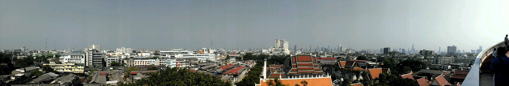

Hey folks, I successfully arrived in Bangkok today. Bel picked me up at the airport and we direktly took a train down town, where I now stay for 2 nights in SiamMitr Hostel. Luckily it's a quit cold and cloudy day with just 25 degree, which is really low for Bangkok. So the climate is really easy for me, it's the perfect Thailand starting weather.. I'm sure there will be more hotter weather soon, so stay tuned..

