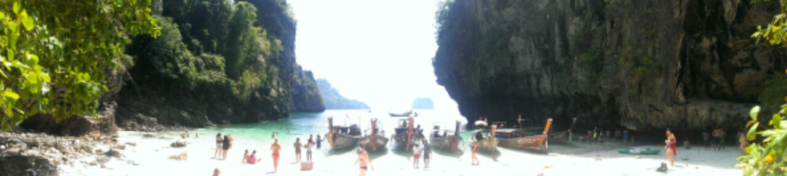
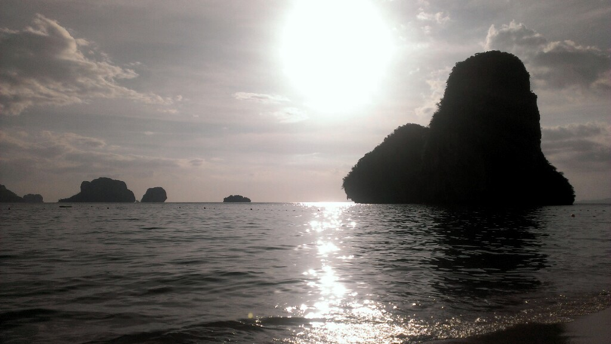

Yesterday I booked a trip for deep water soloing (dws). It's free climbing combined with cliff jumping. It was really good fun with about 20 other people! A longtail boot took us to a 'lonley' island within a 20 min ride from Ton Sai. For spicy chicken lunch the boot stopped at a small beautiful beach nearby the dws spot...

While I wrote this I'll leave Ton Sai Bay tomorrow. Heading further east to reach Prachuap Khiri Khan in a view days. Finally for you... just another nice sunset at Prag Nang Beach :)

