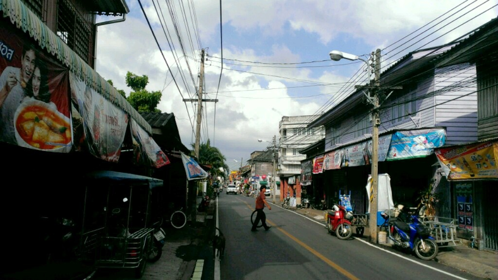
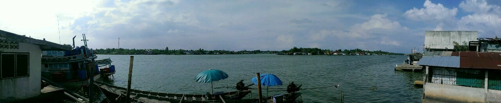

Actually I'm traveling north. I took a bus from Krabi to Surat Thani and stayed there for one night. Surat Thani is a really busy industrial thai city. It looked dirty and hectic, so it's more a stop over than a tourist attraction. Nevertheless the hotel I had was quite good...

I'm looking forward to my next stations wich will be Prachuap Khiri Khan and Hua Hin.  There I gonna stay some longer to check out beaches, national parks and planed to do some hiking.. we'll c soon... cheers x

