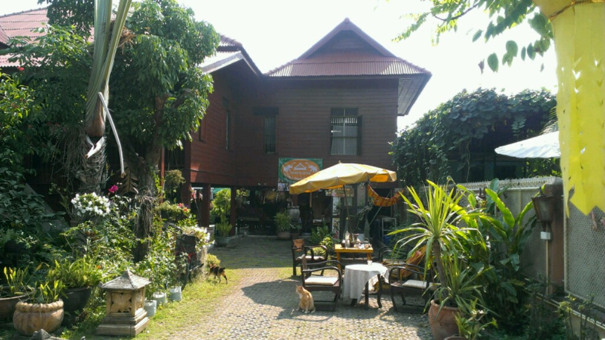
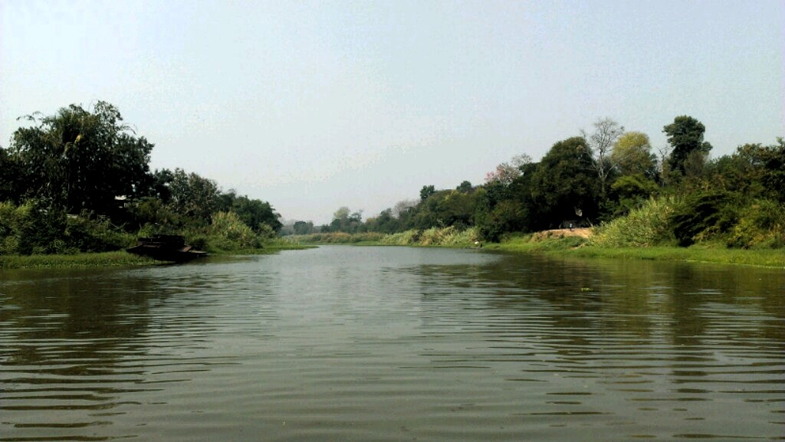

Yesterday I arrived in Chiang Mai which is one of the biggest cities in northern Thailand. It's quite touristic but it seems to be a nice place to stay for some days. I had a really fucked up dorm for the first night which smelled a lot like toilette & pee, for like 120 BHT per night, all right... Nevertheless changed today to a really nice accommodation which is 300 BHT. What you reserve is what you get. So better spent some "more" money and you're mostly fine.

Here's a picture taken at Chiang Mai Ping river during a boot trip I had today:

Tomorrow evening I gonna pick up Aline and Julie from the airport to continue travelling with them together...
