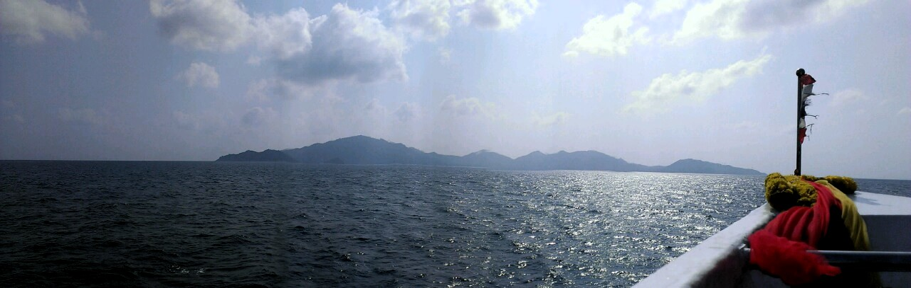
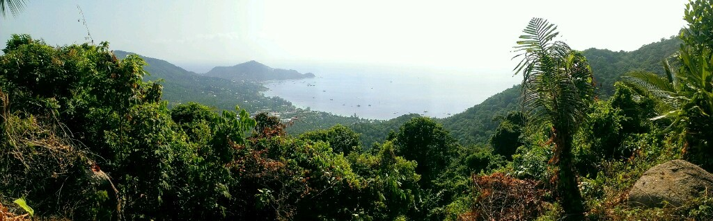
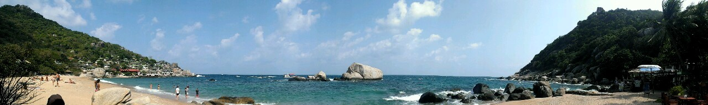
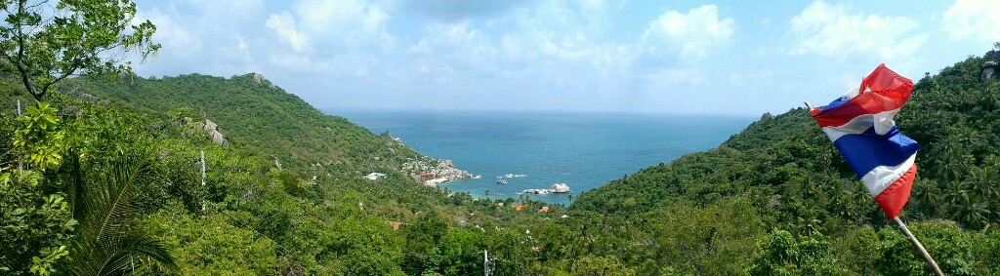

Yesterday we arrived at Ko Tao. A beautiful touristic rockey island within the gulf of Thailand. Today we rented a scooter and drove to a nice snorkeling bay, Ao Hin Wong. There we saw a lot of colored fish and some not really healthy looking corals. Nevertheless it was a really amazing day trip!

Here is the island photographed during our arrival by ferry,

as well as a viewpoint up in the hills, which shows Ao Mae Hat. This is where the ferry arrived.

This is the beach Ao Tanote where our bungalows are located up in the hills.

Additional a nice shot from above the hills, taken from our bungalows "Tanote View" restaurant..

