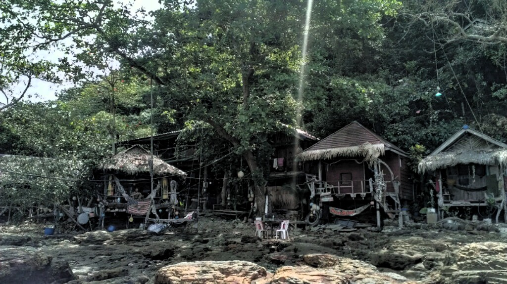
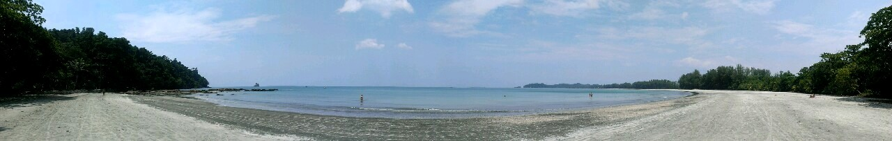
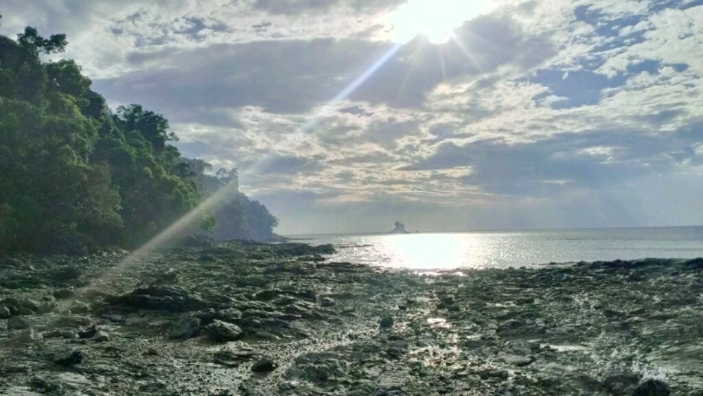

This is Palmbeach Bungalows where we actually stay. The bungalow owner "Yuppie" is one of the best 'Herbergsvaters' and cooks I've ever had. The hut in the middle - the one behind the tree - is ours for the next few days.

It is the last accommodation at the south east end of Koh Phayam. The so called Long Beach, "Ao Yai".

Here you see the sunset photographed yesterday directly from our bungalows, welcome in paradise ;-)

